# **HOL02-Report**
_Levian Gonzalez, Boglarka Matuz_

## Overview
This report provides a detailed overview of the proposed hybrid infrastructure for Project HOL02 on AWS. The infrastructure consists of a Virtual Private Cloud (VPC) segmented into three subnets: Production, Research, and DMZ. Each subnet hosts specific services and is secured with appropriate security groups.

### 0. Prerequisites
Generate key named HOL02 and import it

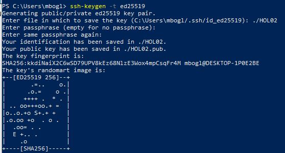

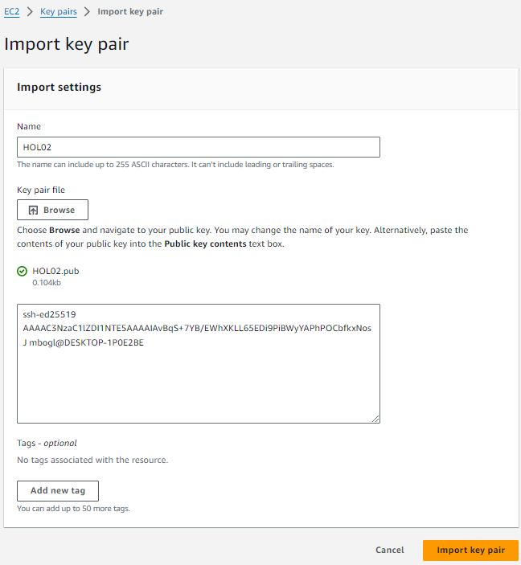

### 1. Configure all the AWS resources mentioned in the architecture diagram

**1.1 Virtual Private Cloud (VPC)** 

_The Virtual Private Cloud (VPC) serves as the foundation of our AWS infrastructure, providing isolated network resources for our services. The chosen CIDR block (10.0.0.0/16) allows for ample IP address space for future scalability._

**Create VPC**

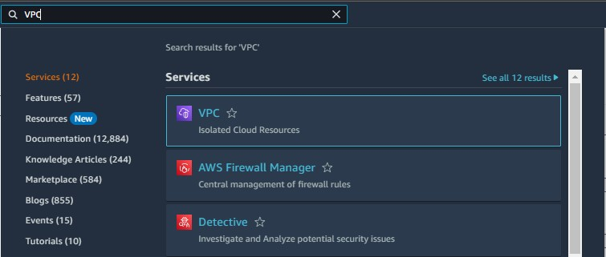
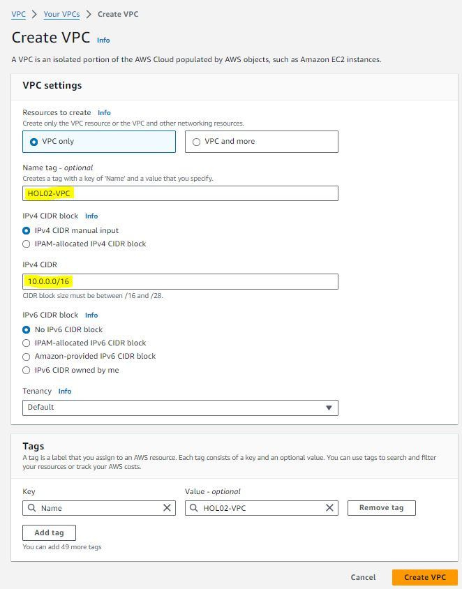

**1.2 Create subnets**

_Using different availability zones, so if one of them is down, we can still use the others. Also using different ranges._

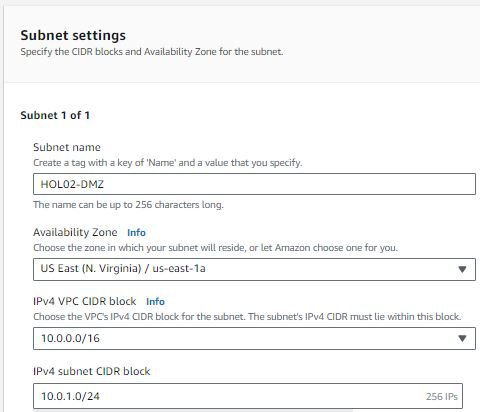
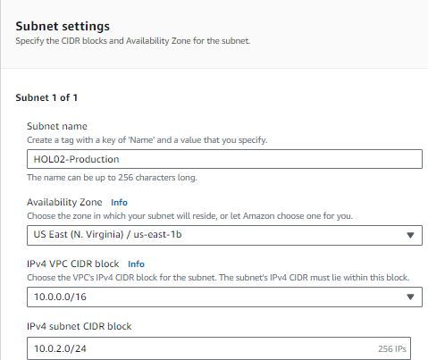
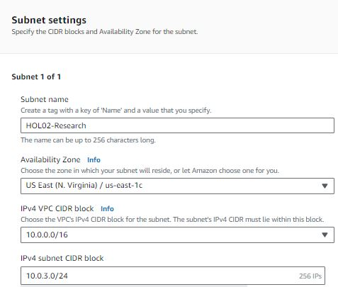

_All the subnets listed:_
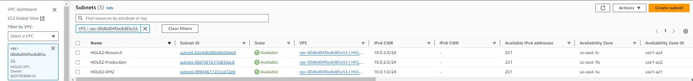

**1.3 Create Internet Gateway**

_The purpose is connect the routing tables to the internet_

_Create and attach to VPC_

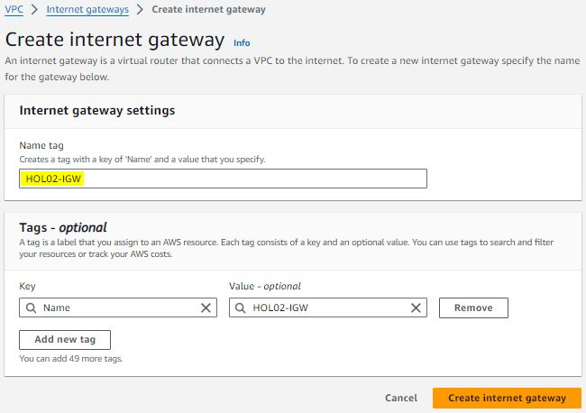
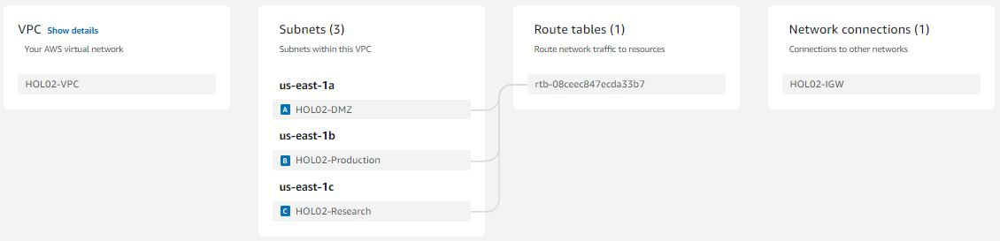

**1.4 Configure Routing Tables**

_Now that we have the internet gateway, but it is still disconnected. Routing tables are needed, so that subnets are able to access the internet_

Create routing tables for each subnet and create associations:

_(The exact example of DMZ)_

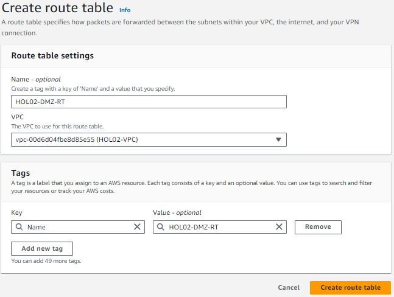
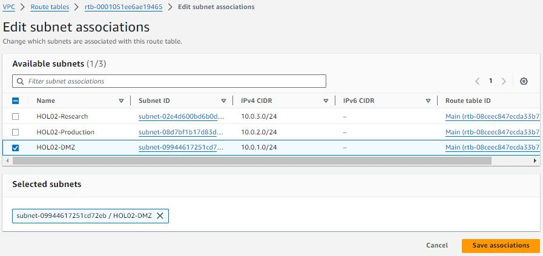
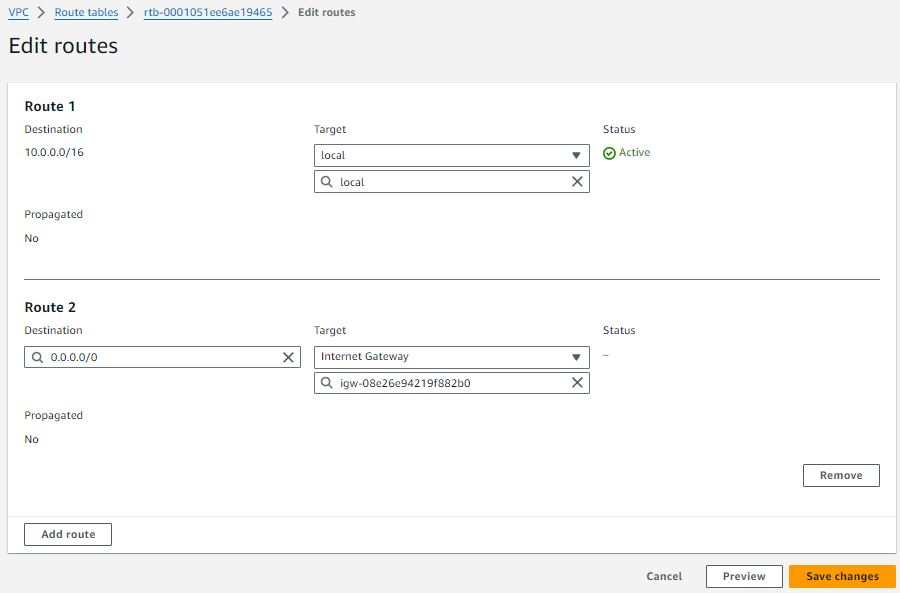

After following these steps for each subnet, the connection is shown on the resource map:

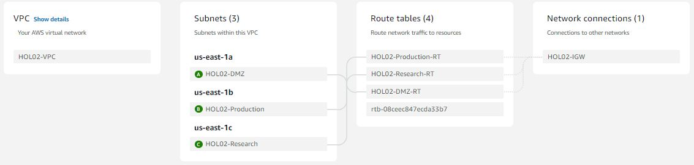

