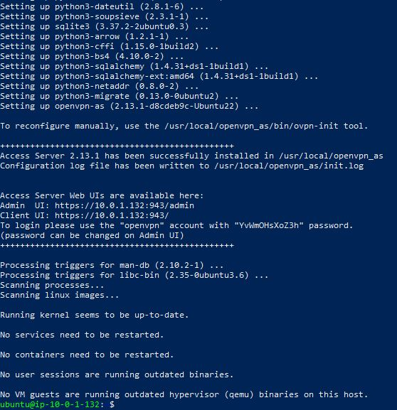

# **HOL02-Report**
_Levian Gonzalez, Boglarka Matuz_

## Overview
This report provides a detailed overview of the proposed hybrid infrastructure for Project HOL02 on AWS. The infrastructure consists of a Virtual Private Cloud (VPC) segmented into three subnets: Production, Research, and DMZ. Each subnet hosts specific services and is secured with appropriate security groups.

### 0. Prerequisites
Generate key named HOL02 and import it

### 1. Configure all the AWS resources mentioned in the architecture diagram

**1.1 Virtual Private Cloud (VPC)** 

_The Virtual Private Cloud (VPC) serves as the foundation of our AWS infrastructure, providing isolated network resources for our services. The chosen CIDR block (10.0.0.0/16) allows for ample IP address space for future scalability._

**Create VPC**

**1.2 Create subnets**

_Using different availability zones, so if one of them is down, we can still use the others. Also using different ranges._

_All the subnets listed:_

**1.3 Create Internet Gateway**

_The purpose is connect the routing tables to the internet_

_Create and attach to VPC_

**1.4 Configure Routing Tables**

_Now the internet gateway is established, but it is still disconnected. Routing tables are needed, so that subnets are able to access the internet_

Create routing tables for each subnet and create associations:

_(The exact example of DMZ)_

After following these steps for each subnet, the connection is shown on the resource map:

**1.5 Security Groups & EC2 instances**

_Security groups are created during launching the instances_

_**HOL02-VPN**_

Extra steps are taken to associate elastic IP with instance

_**HOL02-VoilaServer**_

Extra steps are taken to only accept inbound traffic from HOL02-DMZ-SG through port 22(SSH)

_**HOL02-Jupyter**_

Extra steps are taken to only accept inbound traffic from HOL02-DMZ-SG through port 22(SSH) and port 8888(TCP)

**1.6 S3 Buckets**

_Create S3 bucket_

When trying to create the bucket with the expected naming "HOL02-Notebooks" an error has been encountered. To resolve lower case letters were used and also our initials with versioning to have a unique bucket name.

### 2. Create a Jupyter Notebook named hol02-app.ipynb and upload it to the S3 bucket
 

### 3. OpenVPN Configuration

The steps provided were followed to install OpenVPN on the HOL02-VPN instance

After installation, we navigated to https://3.229.85.43:943/admin and logged in

Once logged in, in the VPN Settings and changed the hostname to the elastic IP

Then subnets were added and "Should client Internet traffic be routed through the VPN?" was set to "No"

**Installing the OpenVPN client**

### 4. Nginx Configuration

The commands provided were followed to install Nginx on the EC2 instance named HOL02-VoilaServer:
 

### 5. Jupyter Configuration

For the installation of python the steps shown in class were followed. 

_(1. vi install.sh and using the code that was shared_
_2. 2. bash install.sh)_

_Then using pip install jupyter, to install jupyer as well._

The following steps show the configuration:

### 6. Synchronization

To set up a cron job to synchronize files from an EC2 instance to an S3 bucket, firstly _awscli_ packge was installed.

_connection to HOL02-Jupyter isntance_

